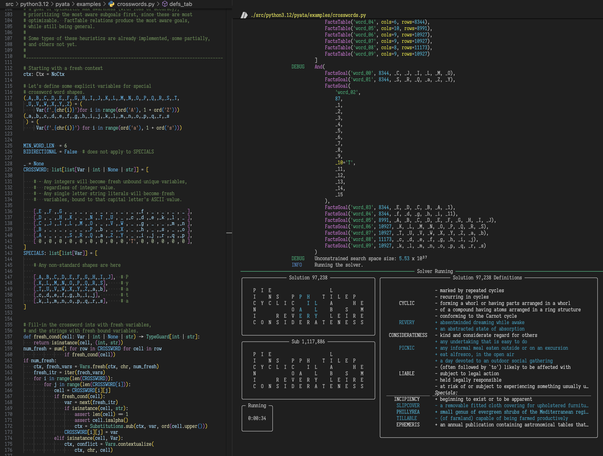

# Pyata

Pyata is a general logic solver in Python.  It is based on its own implementation of miniKanren relational programming EDSL (embedded domain specific language).  Pyata is under heavy development, and its API is still very fluid.  Consider it pre-alpha.

Notable features:

- `Facets`: Modular, immutable HAMT-based context weaving,
  enabling minimal accidental complexity of extensions
- Support for creating custom hooks for extensions (Events, Broadcasts, Pipelines)
- Performant metrics (counters, gauges, stopwatches), with per-second stats timeseries (can be used for ML search guide)
- Live state observation with Rich integration
- Custom constraint support, with propagation
- Performant numpy-based facts relations
- Extensible connective heuristics
- Systemic utilization of goal's levels of "awareness":
  - `Vared`: does the goal keep track of its variables?
  - `CtxSized`: is the goal aware of its search-space size?
  - Does it provide hooks for tracking progress?

