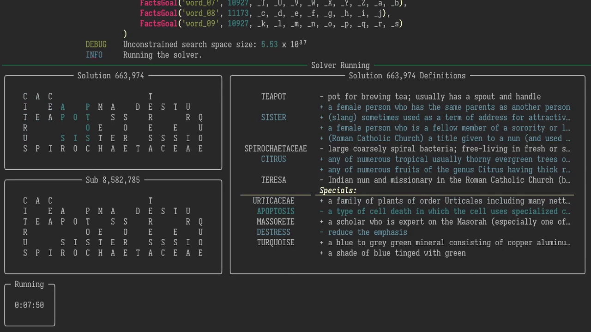
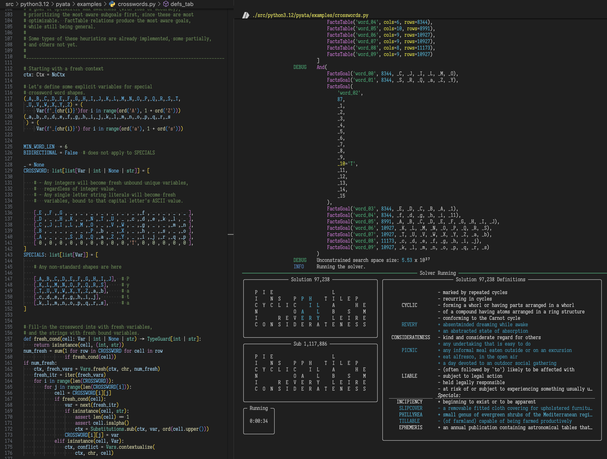
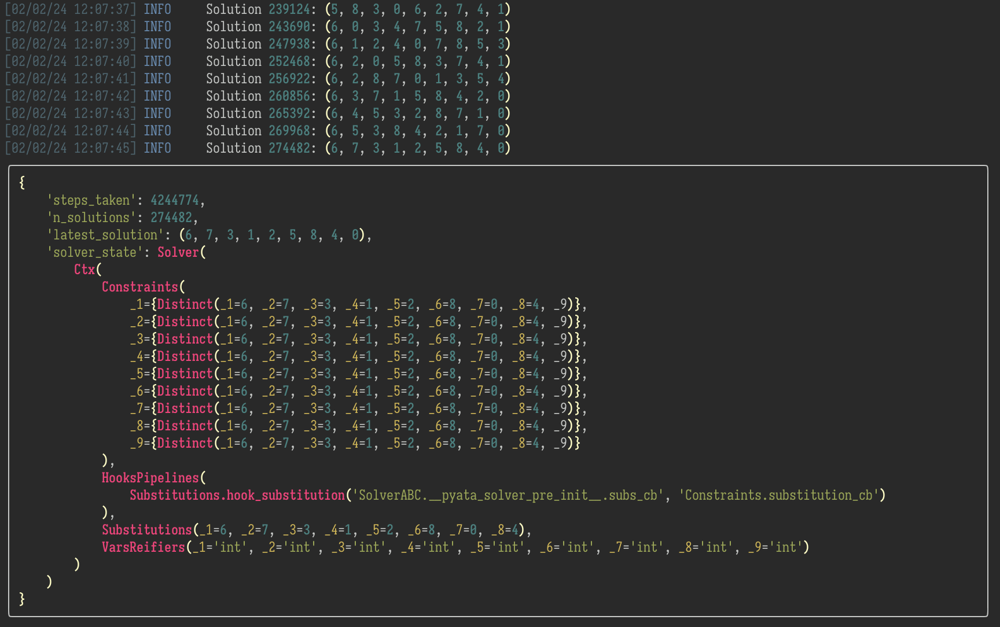

# Pyata

Pyata [ˈpʲjɑtɐ] is a general logic solver (or symbolic rule-based inference engine) in Python.  It is based on its own implementation of miniKanren relational programming EDSL (embedded domain specific language).  Pyata is under heavy development, and its API is still very fluid.  Consider it pre-alpha.

## Features

- The usual miniKanren goodness of:
  - Omnidirectional computation (forward, backward, or fill in the holes)
  - Guaranteed solutions if they exist, even in presence of failing infinite recursive search spaces branches
- `Facets`: Modular, immutable HAMT-based context weaving,
  enabling minimal accidental complexity of extensions
- Support for creating custom hooks for extensions (Events, Broadcasts, Pipelines)
- Performant metrics (counters, gauges, stopwatches), with per-second stats timeseries (can be used for ML search guide)
- Live state observation with Rich integration
- Custom constraint support, with propagation
- Performant numpy-based facts relations
- Extensible heuristics at any level (hierarchical logical connectives, inter/intra-goal integration support)
- Systemic utilization of goal's levels of "awareness":
  - `Vared`: does the goal keep track of its variables?
  - `CtxSized`: is the goal aware of its search-space size?
  - Does it provide hooks for tracking progress?
- [*soon*] `Sympy` integration for expressive constraints, and constraints simplification during propagation

## Planned Integrations

- Z3 SMT solver to speed up many aspects of constraint propagation and search optimization.  It's incremental mode fits Pyata almost as naturally as Sympy does
- TensorFlow and/or PyTorch for ML-based search guidance

## Potential Integrations

- Pyomo for optimization
- SVXPY for convex optimization
- one of topological optimization libraries for experimential search guidance
- PuLP for linear programming, maybe?
- Gurobi for mixed integer programming, maybe?

## Possible Applications

### Immediate (more or less)

- DCG specification for context-aware language grammar, providing at the same time parsing, generation, hole-filling, and with a bit more effort, translation
- Prototyping solvers for any specific problem domain that doesn't have a dedicated solver readily available
- prototyping new type systems, and programming languages
- [Experimential mathematics](https://en.wikipedia.org/wiki/Experimental_mathematics)

### Non-immediate

- Relational interpreters for existing programming languages, providing cutting-edge type inference, checking, and proving; implementation inference, automatic edge-case detection, test-case generation with edge-case coverage verification, general verification that is certifiable (in a sense of "here are the steps that [dis]prove it")

### Longer-term

- Uptraining existing base LLM model to always use a tool like this for reasoning, making them robust and reasoning transparent.

## Screenshots
Examople from [./src/python3.12/pyata/examples/crosswords.py](./src/python3.12/pyata/examples/crosswords.py),
demonstrating performance of unification over a large search space.

Example from [./src/python3.12/pyata/examples/permutations.py](./src/python3.12/pyata/examples/permutations.py),
demonstrating live context observation.

